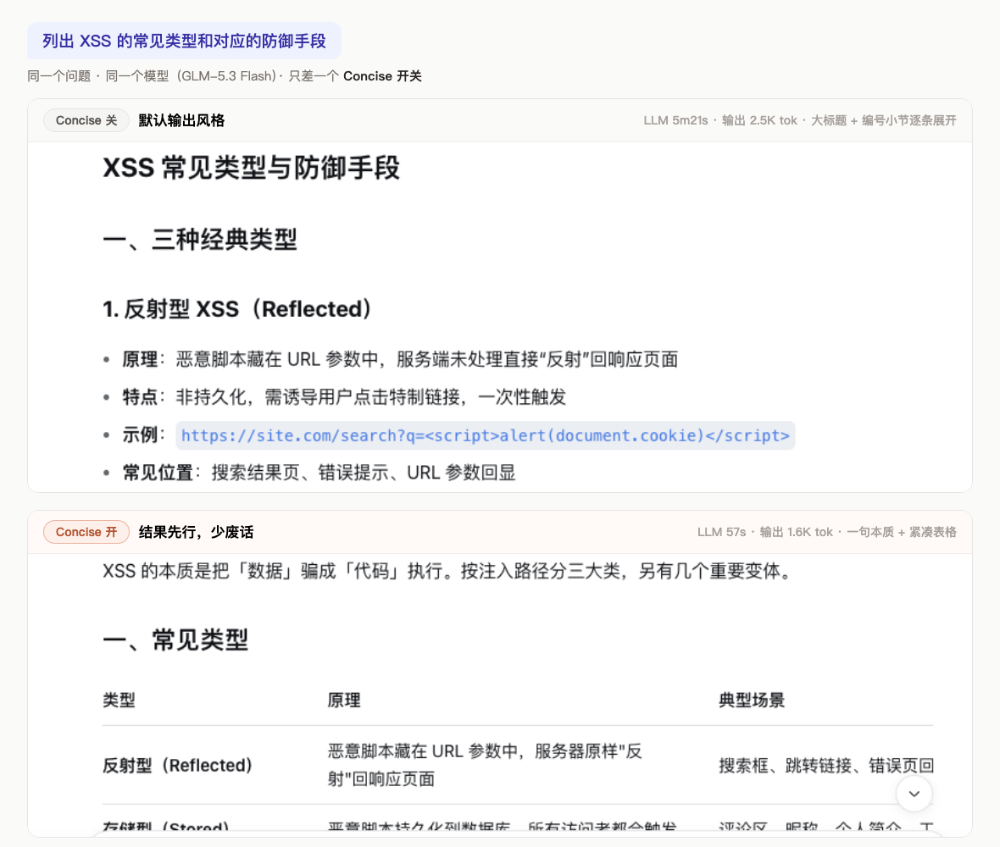
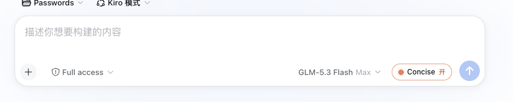
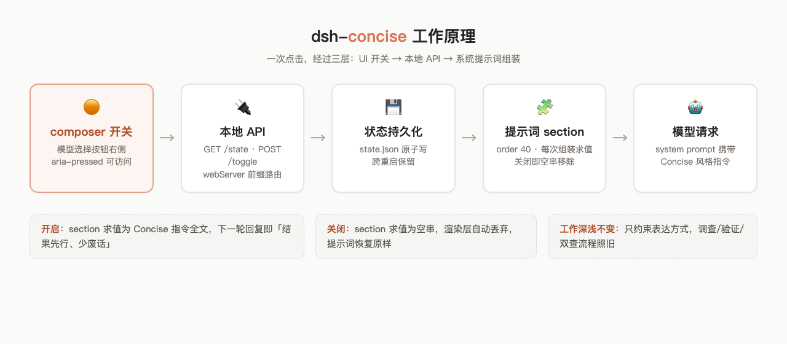

# dsh-concise


把 Claude Code 内置的 **Concise 输出风格** 带进 DeepSeek Harness（dsh）：composer 模型选择按钮右侧一键开关——**结果先行，少废话**，而调查、验证、多角度审查的工作深浅完全不变。

[**English**](README.en.md) · [Releases](https://github.com/hoyyang/dsh-concise/releases) · [更新日志](CHANGELOG.md)

<p align="center">
  
  
  
  
  
  
</p>

## 安装

```sh
dsh plugin add hoyyang/dsh-concise   # GitHub 仓库
# 或
dsh plugin add dsh-concise           # npm 包
```

**零配置，开箱即用**：不需要 API Key、不需要账号、没有任何设置项。装完刷新 Web 界面，composer 工具行就会出现开关。要求 dsh web 0.1.0-rc.8+（实测通过）。

## 开关前后，差在哪？

同一个问题、同一个模型（GLM-5.3 Flash），只差一个 Concise 开关：



开启后你会得到：

- **第一句就是答案**——没有"好的，让我来解释一下"，没有铺垫和旁白
- **砍掉的是水分，不是内容**——命令、路径、风险、下一步这些硬信息一字不少；省掉的是重复收尾、"综上所述"式复述、装饰性小节
- **工作深浅不变**——该查证的照常查证，该验证的照常验证，提示词里写死了"thoroughness unchanged"
- **长会话净省 token**——每轮省掉的开场白与复述，累积下来相当可观

一句话：**答案没有变小，废话没有了。**

## 30 秒上手

1. 装好插件，刷新页面
2. 在 composer 工具行找到模型选择按钮（如 `GLM-5.3 Flash`）——它右边就是 `● Concise` 开关
3. 点一下，下一轮回复即生效。橙色 = 开，灰色 = 关



开关**按会话独立**：在这个会话开了，别的会话不受影响（新会话默认关；想要新会话默认开启可配置 `defaultEnabled: true`）。

## 进阶用法

### `/concise` 命令

输入 `/concise` 从 slash 菜单执行（CLI 会话里同样可用）：

```text
/concise          # 切换（开 ⇄ 关）
/concise on|off   # 显式设置
/concise status   # 查看当前会话状态与风格来源
```

### 自定义风格文本

把你的风格写进 `~/.dsh/dsh-concise/style.md`（非空即整体覆盖内置文本，删除即恢复）。保存后下一轮生效，`/concise status` 会显示来源。实测示例——style.md 为「Answer in one short sentence, then stop.」时：

> REST API 是一种基于 HTTP 协议、用 GET/POST/PUT/DELETE 等标准方法对 URL 表示的资源进行无状态增删改查的网络接口规范。

恰好一句、无列表、无展开。

### API（脚本 / 自动化友好）

```sh
curl "http://127.0.0.1:3080/dsh-concise/api/state?sessionId=<id>"   # 查询某会话
curl -X POST -H 'content-type: application/json' \
  -d '{"sessionId":"<id>"}' http://127.0.0.1:3080/dsh-concise/api/toggle   # 切换某会话
```

## 实际注入的提示词（原文）

开启后，以下文本作为系统提示词 section 注入当前会话的每轮模型请求（`order 40`）：

```text
Concise output style (active): lead with the result. Put the answer, the decision, or the finished artifact in the first sentence or two; explanation follows only as needed.
- Never open by restating the question or with pleasantries ("Sure", "Great question", "好的", "当然可以") — the first line is already the answer or the key finding.
- Skip filler closers: no recap of what you just did, no "In summary" restating the response, no boilerplate apologies or hedges, no closing offers ("需要我…吗？") unless a decision is genuinely required.
- For enumerable facts prefer a table or a tight list over paragraphs — structure is not verbosity; compact and structured beats long and prosy.
- Keep every load-bearing detail: constraints, risks, exact commands, file paths, and next actions are content, not filler — compress wording, never omit substance.
- No narration between steps: report what changed, not what you are about to do ("Let me check...", "I'll now...").
- Thoroughness of the work is unchanged: investigate, verify, and double-check exactly as you otherwise would; only the reporting is compressed.
- When you made a choice, state it with a one-line reason; surface alternatives only when they are viable and materially different.
```

## 功能一览

- **一键开关**：composer 工具行模型选择按钮右侧的 `● Concise 开/关` 按钮，单击即切换
- **`/concise` 命令**：slash 菜单与 CLI 会话均可 `/concise`（切换）、`/concise on|off`（显式设置）、`/concise status`（查状态与风格来源）——对齐 Claude Code 的 `/output-style`
- **自定义风格**：把任意文本放进 `~/.dsh/dsh-concise/style.md` 即可整体覆盖内置风格文本（改完保存，下一轮组装即生效）——对齐 Claude Code 的 `/output-style:new`
- **Claude 同款风格**：完整移植 Claude Code 内置 "Concise" output style 的行为定义（结果先行、跳过开场白与旁白、不重复收尾）
- **工作深浅不变**：只约束表达方式——调查、验证、多角度审查照旧，绝不因简洁而牺牲严谨
- **下一轮即生效**：通过系统提示词 section 动态注入，切换后无需重开会话、无需重启
- **按会话独立生效**：开关只影响当前会话的新回复，会话之间互不干扰（新会话默认关闭，可用配置 `defaultEnabled` 调整）
- **跨重启持久**：开关状态原子写入 `~/.dsh/dsh-concise/state.json`，重启后保持
- **状态自动同步**：按钮以 15s 轻量轮询（仅可见标签页）+ focus/visibility 重取，`/concise`、API、其它标签页的改动 ≤15s 自动跟上，无需刷新
- **可视化状态**：开启态 Claude 橙描边 + 实心圆点 + 「开」，关闭态中性灰 + 空心点，一眼可辨
- **无障碍友好**：`aria-pressed` 开关语义 + 中英双语 tooltip 说明
- **多标签页同步**：任意一个窗口切换后，同页其它开关实例经自定义事件即时同步
- **UI 精准落位**：自动锚定模型选择按钮紧右侧（官方 right 槽实际渲染在模型按钮左侧，本插件做了位置修正）
- **优雅降级**：找不到模型按钮的异常布局下自动退化为原位渲染，功能不丢
- **卸载即净**：提示词 section、HTTP 路由、host 命令、样式表全部随插件卸载移除，无残留
- **本地化**：界面文案跟随 dsh 语言设置，内置中英双语兜底

## 适用场景

- **日常问答 / 学习总结**：概念解释、术语速查，直接要结论
- **代码评审意见**：先给判定与修复建议，再给理由
- **Bug 分析汇报**：根因一句话先行，证据链后置
- **周报 / 日报生成**：成果先行，过程压缩成列表
- **方案与架构讨论**：先给决策与一句话理由，备选方案只在有实质差异时提及
- **命令行 / 运维协作**：命令与路径原样保留，解释压到最短
- **多轮长会话**：累积上下文时省掉每轮的寒暄与复述 token
- **工作区隔离验证**：给正在跑别的任务的会话开 Concise，不影响其它会话的输出风格
- **给别的模型当风格基线**：配合模型切换按钮使用，任何模型都套同一输出风格
- **自动化流水线**：用 API 让脚本按阶段切换输出风格（如生成阶段简洁、评审阶段自然）
- **演示与教学录制**：录屏时回复紧凑，画面信息密度更高

## 工作原理



| 层 | 机制 |
| --- | --- |
| 提示词注入 | `systemPrompt.section({ name: 'dsh-concise:style', order: 40 })`，text 为函数、每次模型组装按 `context.agent.session.id` 取当前会话开关求值；关闭时返回空串，渲染层自动丢弃该 section |
| host 命令 | `commands.register({ name: 'concise' })`：`/concise [on\|off\|status]`，作用于当前会话，slash 菜单自动收录，CLI 会话同样可执行 |
| 自定义风格 | `$DSH_HOME/dsh-concise/style.md` 非空时覆盖内置文本，mtime 缓存按次求值，改完即生效 |
| 开关 API | `webServer.register` 前缀路由 `/dsh-concise/api`：`GET /state`、`POST /toggle`、`POST /set`，带 `sessionId` 操作该会话，不带则操作新会话默认值（仅本机回环） |
| 会话级状态 | `$DSH_HOME/dsh-concise/state.json`：`default` + 每会话覆盖（500 条 LRU 淘汰），tmp + rename 原子写 |
| UI 落位 | client 模块注册 `conversation.input.right` 槽作锚点，把按钮 portal 到模型 seat 紧右侧，`MutationObserver` 维持相对位置；React 重渲染/seat 重建后自动对位 |
| 状态同步 | toggle 后按会话广播 `dsh-concise:change` 自定义事件；15s 轻量轮询（仅可见标签页）+ focus/visibility 重取，覆盖命令行/API/其它会话入口的状态变更 |

### 设计细节

- **为什么不用官方 right 槽直接放按钮？** 实测官方 `conversation.input.right` 列表槽渲染在模型按钮**左侧**（与其文档描述相反）。本插件以槽位条目为自定位锚点，将 portal 容器插入模型 seat 的紧右侧，并保持会话切换/重渲染后的位置正确。
- **为什么 text 用函数而不是注册/注销 section？** 函数式 text 让"开关"只是求值结果的变化，不触碰 slot 注册表，避免与其它插件的注册时序竞争。
- **权限模型**：API 只绑定本机回环；提示词注入不触碰任何工具 schema，不影响会话权限模式。

## 可靠性与验收

以下验收项在 dsh 0.1.0-rc.8 实机全部通过：

- API 矩阵：`/state`、`/toggle`、`/set`、未知路径 404，输入输出全部断言通过
- 端到端提示词验证：开启后新会话请求的 system prompt 实测携带 `Concise output style (active)`（会话日志逐字核验）；关闭后同会话下一轮请求 0 命中
- 会话隔离验证：同一会话关→0 命中 / 开→1 命中（其它会话与 default 不受影响），按钮 fetch 实测携带真实 sessionId
- 自定义风格端到端：style.md 写入后请求实测携带自定义文本且内置文本 0 命中（完全替换）；删除后恢复内置；回复实测遵循自定义指令（恰合一句、无列表）
- `/concise` 命令矩阵：toggle / on / off / status 四路径实测通过，slash 菜单正确收录与执行
- 回复风格实测：解释类问答开启后直接以结论开头，无开场白、无收尾复述
- UI 落位断言：composer 工具行 DOM 顺序为 `[模型选择][Concise][上下文][发送]`
- 交互断言：单击翻转状态、`aria-pressed` 同步、按钮文案与状态一致
- 跨入口同步断言：API 翻转后按钮 ≤15s 自动跟上（轮询实测），focus/visibility 重取生效
- 持久化断言：切换后 `state.json` 即时落盘，页面刷新后状态一致
- 热重载验证：`lib/client.js` 热重载后 fiber 重建、UI 即时更新
- 卸载即净验证：卸载后 entry / registry / junction / client 模块表全部移除，提示词 section 消失
- 注入器回归：宿主注入器自检 8/8 PASS，确认无连带破坏
- 稳定性验证：全流程浏览器 console 0 错误 0 警告
- 优雅降级：模型 seat 不可寻时自动退化为 right 槽原位渲染；locale 服务缺失时内置文案兜底
- 并发安全：状态写采用 tmp+rename 原子替换，同页多实例经事件同步不串状态

## 常见问题

**开了之后复杂任务的回答会变得敷衍吗？**
不会。提示词明确约束"工作深浅不变"（investigate、verify、double-check 照旧），只压缩表达——该查证的照常查证，该给出的命令/路径/风险一字不少。

**和直接在 AGENTS.md 里写"请简洁回复"有什么区别？**
一是开关粒度：随时一键切换、只作用于当前会话，不用改文件、不用重载；二是作用层级：本插件注入的是系统提示词 section，优先级和稳定性高于项目级指令，且不会污染你的项目配置；三是模型无关：任何模型都套同一输出风格。

**开关是全局的还是按会话的？**
**按会话。** 每个会话独立记忆自己的开关状态，互不影响；新会话默认关闭（可用插件配置 `defaultEnabled: true` 让新会话默认开启）。切换后当前会话的下一轮回复即生效，其它会话不受影响。

**支持暗色主题吗？**
支持。样式全部使用 dsh 的 `--dsw-alias-*` 设计令牌与少量半透明品牌色，明暗主题下均可读。

## 本地构建

```sh
git clone https://github.com/hoyyang/dsh-concise.git
cd dsh-concise
npm run build        # tsc 编译 host + tsdown 打包 client + npm pack
npm run typecheck    # 双 tsconfig 类型检查
```

目录结构：

```text
src/index.ts         host：提示词 section + 会话级状态 + HTTP API + /concise 命令
src/client/index.ts  client：槽位锚点 + portal 落位 + 开关按钮
scripts/build.sh     自包含构建脚本（pnpm/npm 均可）
assets/              README 截图与图示
```

## 许可证

[MIT](LICENSE)
